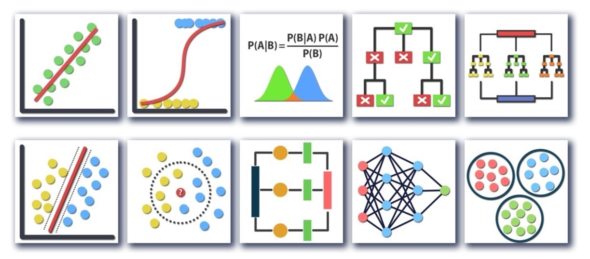

# Data-Analysis-and-ML-Approaches-for-Forecasting-Vessel-Carbon-Emission

## Languages:
- **Python**

## Important Libraries:
- **Pandas**
- **NumPy**
- **Matplotlib**
- **Seaborn**
- **Scikit-learn**
- **TensorFlow/Keras**

## Technologies:
- **Data Analysis**
- **Feature Selection and Engineering**
- **Dimensionality Reduction**
- **Machine Learning**
- **Hyperparameter Tuning**
- **Deep Learning**

## Abstract
This project focuses on forecasting vessel carbon emissions using data analysis and machine learning techniques. Given the increasing concerns and stringent regulations on maritime emissions, predictive modeling plays a crucial role in optimizing fuel consumption and ensuring compliance with emission norms based on the parameters. The system utilizes historical vessel data, including container type, build year, length, gross tonnage and summer deadweight, to build accurate predictive models for carbon emissions. The goal is to provide ship operators with actionable insights for sustainable maritime operations.

## Dataset
The dataset includes historical records of vessel operations, with key features such as:
- Container type
- Build year
- Length
- Gross tonnage
- Summer deadweight
- Efficiency Type
- Efficiency Values

## Methodology
1. **Data Preprocessing**: 
   - Cleaning and handling missing values.
   - Feature selection and engineering.
   - Normalization and scaling.

2. **Exploratory Data Analysis (EDA)**:
   - Identifying key factors influencing carbon emissions.
   - Visualizing trends and correlations.

3. **Machine Learning Models**:
   - **Linear Regression**: Establishes baseline predictions.
   - **Random Forest**: Captures non-linear relationships.
   - **XGBoost**: Optimized for high performance and accuracy.
   - **Deep Learning**: Uses DNN Architectures.
   - And More

4. **Model Evaluation & Optimization**:
   - Performance metrics: RMSE, R² score.
   - Hyperparameter tuning and cross-validation.

## Models
1. **Regression Models**:
   - Linear Regression, Ridge Regression, and Lasso Regression for basic trend analysis.
   
2. **Tree-Based Models**:
   - Decision Tree, Random Forest, XGBoost, Gradient Boosting, Adaboost, CatBoost for improved feature importance and accuracy.
  
3. **Other Models**:
   - KNN is good for regression based on neighbors and SVR for complex regression in high-dimensional data.
   
5. **Deep Learning Models**:
   - Custom DNNs and TabNet for capturing complex information and LSTM networks for sequential dependencies.
  

## Results and Conclusion
The developed models successfully predict vessel carbon emissions based on historical operational data. The CatBoost and Random Forest models demonstrates the highest accuracy, while deep learning approaches capture complex information. The analysis highlights key factors such as fuel consumption and speed as primary contributors to carbon emissions. These insights can help ship operators adopt more fuel-efficient practices and align with global sustainability goals. Future improvements could focus on integrating real-time sensor data and optimizing models for deployment in maritime operations.

## Disclaimer
The forecasting models developed in this project are intended for research and demonstration purposes. The accuracy of predictions depends on data quality, sensor accuracy, and model assumptions. Further testing and validation are required before deployment in real-world maritime operations.
